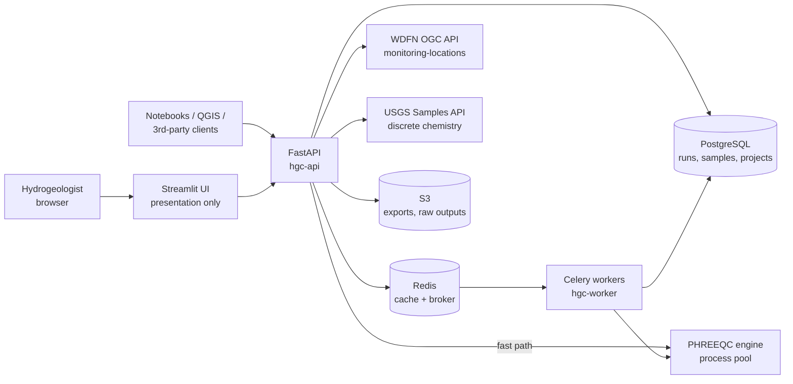
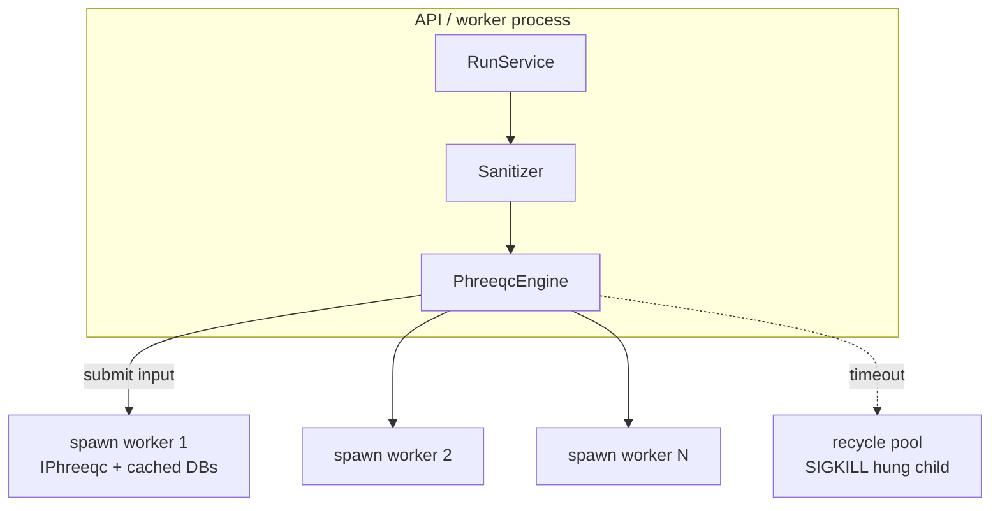
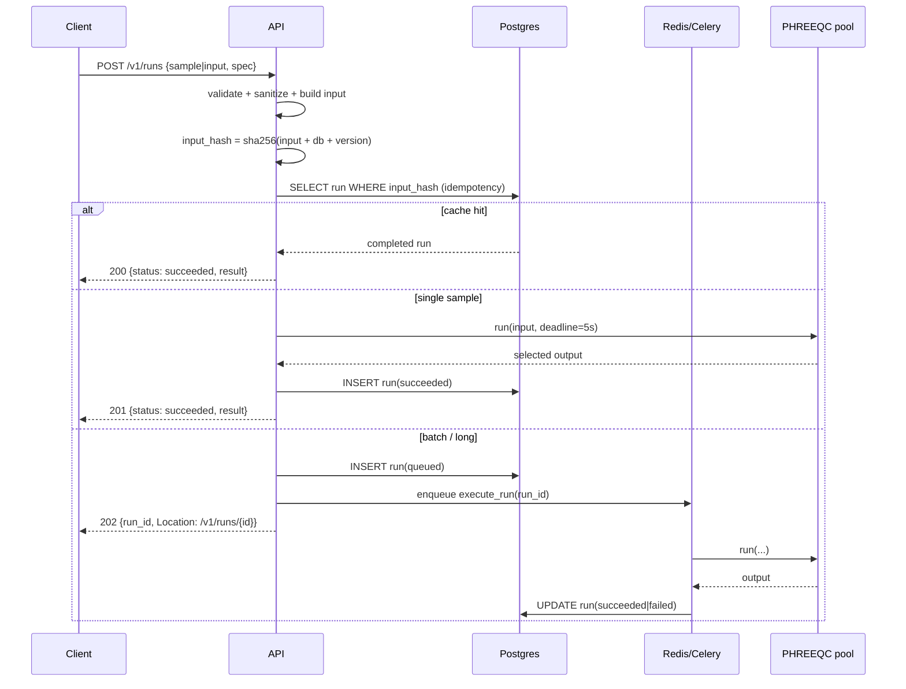
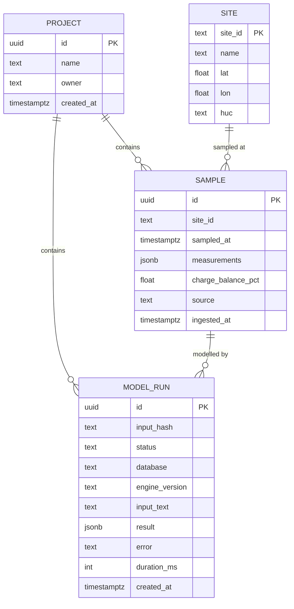
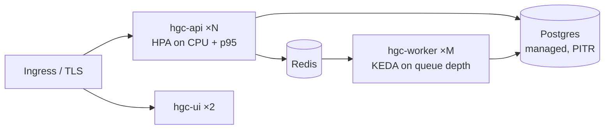

# HydroGeoChem Explorer, Architecture & System Design

Version 1.0 · Owner: Platform/Geochemistry Engineering

**Purpose.** Make the hidden chemistry of water understandable and predictable, so the people
who depend on it can act before a problem reaches the tap. The concrete question the system
answers today is whether a given water will corrode pipes and mobilise metals (the chemistry
behind lead-in-water) or clog them with scale. The same reproducible result serves communities,
utilities, farmers, regulators, and researchers. The technical decisions below all serve that
goal: correct chemistry, safe and reproducible computation, and machine-learning-ready output.

---

## 1. What changed from the MVP, and why

The MVP was a single Streamlit process that fetched USGS data, built PHREEQC input, called the
IPhreeqc DLL in-process, and rendered results. That design fails in production for five specific
reasons:

| MVP behaviour | Production failure mode |
|---|---|
| `IPhreeqc` loaded in the Streamlit process | IPhreeqc is a stateful C library and is **not thread-safe**. Streamlit runs one thread per session, so two concurrent users corrupt each other's solution state or segfault the whole server. |
| `phreeqc.run_string()` called synchronously | A badly-conditioned kinetics or titration run can spin for minutes. There is no way to interrupt a C call from Python, the worker is lost and the request thread is pinned. |
| Free-text PHREEQC input executed verbatim | PHREEQC keywords (`DATABASE`, `DUMP`, `-file`) read and write arbitrary paths. Free-text input is arbitrary file access, i.e. RCE-adjacent. |
| `except:` / `except Exception` returning empty frames | Upstream USGS outages are indistinguishable from "no data at this site". Silent wrong answers in a scientific tool are worse than errors. |
| No unit handling, raw mg/L columns pasted into `SOLUTION` | µg/L metals, alkalinity as CaCO₃, and nitrate as N are silently wrong by 1000×, 1.22×, and 4.43× respectively. Saturation indices are then confidently wrong. |

The production system therefore splits into **three deployables**, a stateless API, a pool of
isolated PHREEQC workers, and a thin UI, around a shared domain library that owns the chemistry.

---

## 2. Requirements

### Functional
1. Search USGS monitoring locations by state, bounding box, or site ID (WDFN OGC API).
2. Retrieve water-quality results for a site over a date range from the USGS Samples API.
3. Normalise heterogeneous results into a canonical `WaterSample` (units, speciation basis, censored values).
4. Generate a PHREEQC `SOLUTION` block with correct units and charge balance from a sample.
5. Run speciation / equilibrium-phase models and return saturation indices, totals, ionic strength.
6. Accept expert-authored custom PHREEQC input, sandboxed.
7. Persist runs so results are reproducible and citable; batch many sites into one job.
8. Export results as CSV/Parquet and a signed report.
9. Discover sites that carry the required analytes (Samples-API finder, by state/bbox), since the
   raw site catalogue lists locations without regard to what was measured.
10. Emit a flat, ML-ready dataset per site (or across many): each row one sample, inputs joined with
    model outputs and a saturation index per phase, at a chosen time resolution.

### Non-functional (targets, measured at the API edge)

| Concern | Target |
|---|---|
| Availability | 99.5% monthly for `/v1/sites`, `/v1/runs` |
| Latency | p95 < 400 ms for cached site search; p95 < 2.5 s for a single speciation run submitted synchronously |
| Throughput | 20 concurrent PHREEQC runs per node, 4 vCPU |
| Durability | Every accepted run is recoverable with its exact input, database name, and engine version |
| Correctness | Charge-balance error reported on every sample; runs with \|CBE\| > 10% flagged, not hidden |
| Isolation | No user input can read or write the filesystem |
| Cost | USGS calls cached; a cold site-year costs ≤ 2 upstream requests |

**Explicit non-goal:** this is not a general PHREEQC-as-a-service for untrusted internet users.
Custom input is a privileged scope (`runs:custom`) granted to authenticated scientists.

---

## 3. Context diagram



---

## 4. Component design

### 4.1 Layering

```
hgc/
  domain/      pure Python. No I/O, no framework. Units, parameter registry,
               sample/spec/result models, charge balance. 100% unit-testable.
  services/    ports + adapters. USGS clients, PHREEQC engine, cache, run orchestration.
  db/          SQLAlchemy models + repositories. The only module that knows SQL.
  api/         FastAPI transport. Validation, auth, error mapping, metrics. No chemistry.
  worker/      Celery tasks. Long/batch runs. Shares services with api.
  ui/          Streamlit. HTTP client of the API. Holds no chemistry and no DB access.
```

Dependency rule: arrows point inward only. `domain` imports nothing from the other packages.
That is what makes the geochemistry testable without a database, a network, or a DLL.

### 4.2 The PHREEQC engine, the hard part

Three constraints drive the design: IPhreeqc is not thread-safe, its calls are uninterruptible
from Python, and loading a database (`llnl.dat` is ~5 MB of thermodynamic data) costs 100–400 ms.



- **Process pool, not threads.** `ProcessPoolExecutor` with the `spawn` context. Each child owns
  its own `IPhreeqc` handles, keyed by database name, so no shared C state exists.
- **Databases cached per child.** First run on a child pays the load; subsequent runs don't.
  Worker recycling (`max_tasks_per_child`) bounds the memory that a leaky C library can accumulate.
- **Timeouts are enforced by killing the child.** `future.result(timeout=…)` cannot cancel a
  running C call, so on timeout the engine tears the pool down (`cancel_futures=True`) and rebuilds
  it. Costly but correct; the alternative is a permanently wedged worker.
- **Resource limits inside the child.** `RLIMIT_AS`, `RLIMIT_CPU`, `RLIMIT_FSIZE=0`, a child
  physically cannot write a file even if a keyword slips past the sanitizer. Defence in depth.
- **Deterministic identity.** Every result records `database`, database SHA-256, and IPhreeqc
  version. A saturation index without its thermodynamic database is not a reproducible number.

### 4.3 Sandboxing custom input

Two layers, because either alone is insufficient:

1. **Static sanitizer** (`services/phreeqc/sanitizer.py`), rejects `DATABASE`, `DUMP`,
   `INCLUDE$`, and any `-file`-family option; enforces a byte cap and an `END`.
2. **Kernel-level limits** in the child process (above), plus running the container as
   non-root with a read-only root filesystem and `no-new-privileges`.

Sanitizer failures return `422` with the offending keyword named, an expert typing `DUMP` should
be told why, not silently truncated.

### 4.4 Ingest and normalisation

`services/usgs.py` exposes a `WaterDataSource` port with two adapters over USGS **Water Data for the
Nation (WDFN)**: the OGC monitoring-locations API for sites (GeoJSON) and the Samples Data API for
chemistry (CSV, `basicphyschem` profile). Everything upstream-specific, retries with jittered backoff
on 5xx/429, timeouts, response caching keyed by a canonical request hash, lives behind that port.
Swapping in a local CSV for tests is a constructor argument.

> **Why WDFN (the 2024–2027 migration):** the legacy NWISWeb/WaterServices site service is being
> decommissioned in early 2027, and USGS discrete water-quality data left the Water Quality Portal for
> the Samples API in 2024. This app was migrated off both. It now uses the OGC monitoring-locations API
> for site search and the Samples API for chemistry, so `USGS-…` sites return real, coordinate-tagged
> analyses again. The `WaterDataSource` port made this a swap of one module, not a rewrite.

Two search surfaces sit on this port. `GET /v1/sites` is the WDFN site catalogue (every location,
unfiltered). `GET /v1/sites/ready` groups Samples-API results by station and returns only sites carrying the
required analytes (`source=wqp` with an optional `provider`, or `source=synthetic` reading the local
`sample` table). `GET /v1/sites/{id}/dataset` is the ML export: it aggregates a site's samples into
time buckets (event/month/quarter/year/window), models each, and emits one flat row per bucket with
inputs, outputs, and a saturation index per phase. The flattening (`services/dataset.py`) is shared
verbatim with the `ops/build_ml_dataset.py` CLI so the two cannot diverge.

Normalisation is where correctness is won:

- Characteristic name + result unit → canonical parameter via the registry (`domain/parameters.py`).
- µg/L → mg/L; alkalinity as CaCO₃ → HCO₃ (×61.016/50.043); NO₃-as-N → `N(5) … as N` handed to
  PHREEQC with the explicit `as` qualifier rather than pre-converted.
- Censored results (`<` detection limits) are kept as `censored=True` and, by policy, entered at
  half the detection limit **and** flagged in the result so the reader knows.
- Charge-balance error is computed before the model runs. It is the single best indicator that an
  analysis is incomplete, and it is surfaced, never suppressed.

### 4.5 Run orchestration and the sync/async split



`input_hash` gives free idempotency: retries and duplicate submissions collapse onto one row, and
identical models across users are answered from Postgres.

---

## 5. Data model



Indexes: `model_run(input_hash)` unique-ish for idempotency, `model_run(status, created_at)` for
the queue view, `sample(site_id, sampled_at desc)`, GIN on `sample.measurements` for analyte queries.
Raw PHREEQC text output over 1 MB goes to object storage; the row keeps the key.

---

## 6. Failure modes and responses

| Failure | Detection | Response |
|---|---|---|
| Upstream (USGS) slow or 503 | timeout / status | Retry ×3 with jitter, then serve stale cache with `stale=true`, else `503 upstream_unavailable` |
| PHREEQC hangs | future timeout | Kill child, recycle pool, `504 phreeqc_timeout`, run marked failed with input retained |
| PHREEQC convergence error | non-zero return + error string | `422` with the parsed PHREEQC error lines, these are user-actionable (e.g. missing element for a requested phase) |
| Pool broken (`BrokenProcessPool`) | executor exception | Rebuild pool once, fail the request, alert if rate > 1/min |
| Redis down | connection error | Cache degrades to no-op; queue submission returns `503`, sync path still works |
| Postgres down | connection error | `/readyz` fails, pod removed from service |
| Poison batch item | task exception | Per-item isolation: one site's failure never fails the batch; recorded per item |

Every error is a typed `HgcError` mapped to an RFC-7807 problem document with a stable `code`.

---

## 7. Observability

- **Structured JSON logs** with `request_id` propagated through API → Celery → engine.
- **Metrics** (Prometheus): `hgc_phreeqc_run_seconds` (histogram, by database/outcome),
  `hgc_phreeqc_pool_recycles_total`, `hgc_upstream_request_seconds{service}`,
  `hgc_cache_hits_total`, `hgc_run_total{status}`, queue depth and age.
- **Traces** (OpenTelemetry): one span per upstream call and per PHREEQC execution.
- **Alerts that matter:** pool recycles > 1/min (a class of input is hanging), upstream error rate
  > 20% over 5 min, queue oldest-message age > 5 min, sanitizer rejection spike (probing).

---

## 8. Security

- AuthN: OIDC bearer tokens; service accounts use API keys. Scopes: `sites:read`, `runs:write`,
  `runs:custom` (raw PHREEQC input), `admin`.
- AuthZ at the repository boundary, every query is filtered by project membership.
- Rate limits per principal: 60 req/min general, 10 runs/min, 1 batch job at a time.
- Containers: non-root, read-only rootfs, dropped capabilities, no egress except USGS WDFN APIs.
- Secrets from the environment/secret manager, never in images or the database.
- PII: none by design. Site coordinates are public data; project names may be sensitive, so log
  identifiers, not names.

---

## 9. Deployment and scaling



- API and UI are stateless; scale horizontally. Workers scale on queue depth, not CPU, PHREEQC
  runs are CPU-bound and bursty.
- Sizing rule: `phreeqc_workers ≈ vCPU`, since each run saturates one core. Do not oversubscribe;
  contention turns a 200 ms speciation into a timeout.
- PHREEQC databases ship in the image at a pinned commit and are checksum-verified at startup. A silently changed `llnl.dat` invalidates historical results. **Compatibility caveat:** the
  IPhreeqc build bundled in `phreeqpy 0.6.0` cannot parse the newer Peng-Robinson gas sections in
  `usgs-coupled/phreeqc3`'s `phreeqc.dat`/`pitzer.dat` (loads fail, every run then errors with a
  generic `phreeqc_error`). The fetch scripts therefore source those two files from the
  `phreeqpython` mirror and the rest from `usgs-coupled`. Any database or engine upgrade must be
  gated on a real speciation run succeeding, not just on the files downloading.
- Migrations via Alembic run as a pre-deploy job; all migrations expand-then-contract so a rollback
  never loses data.

---

## 10. Testing strategy

| Layer | What is tested | How |
|---|---|---|
| domain | unit conversion, alkalinity basis, charge balance, input rendering | pure pytest, golden files for `SOLUTION` blocks |
| services | retry/backoff, cache keys, Samples/OGC parsing, sanitizer rejections | `respx`-mocked HTTP, fixture CSVs |
| engine | timeout → recycle, database checksum, SI parsing | real IPhreeqc where available, skipped otherwise |
| api | auth, error mapping, idempotency, 202 flow | `httpx.ASGITransport` |
| scientific regression | SI for a known analysis (e.g. NIST/USGS example 1) within tolerance | nightly, tolerance ±0.01 SI |

The scientific regression suite is the one that stops a "harmless" refactor from moving calcite SI
by 0.3 and nobody noticing for a year.

---

## 11. Roadmap

1. **v1.0**, this document: sites, samples, speciation + equilibrium phases, custom input, batch.
2. **v1.1**, mixing, titration, and kinetics templates; Piper/Stiff/Durov diagrams server-side.
3. **v1.2**, reactive transport (`TRANSPORT`), longer deadlines, dedicated worker class.
4. **v1.3**, project sharing, signed PDF reports, DOI-able run permalinks.
5. **v2.0**, inverse modelling (`INVERSE_MODELING`) and uncertainty propagation over analytical error.
